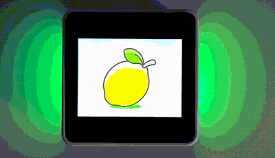

# M5Stack Core2 - LVGL (Images) + FastLED example 



The M5Stack Core2 - LVGL (Images) + FastLED example is a project that showcases the capabilities of the M5Stack Core2 development board, the LVGL graphics library and FastLED. 

# Quickstart
 - Clone repository
```
git clone https://github.com/alptbz/core2imagedemo
```
 - Open repository with PlatformIO
 - rename `src/config.cpp.template` to `src/config.cpp`
 - Adjust serial port in `platform.ini`
 - Build and upload

# Add images
Images can be loaded from SD card or build right into the code. This example uses later. 

 1. Edit PNG if needed:
    1. Adjust the image size to a suitable screen size (for example, 200 x 200 pixels).
    2. If applicable: Replace the transparent background with *pure green* (RGB: 0x00FF00). The LVGL library will automatically make all areas that are *pure green* transparent.
 2. Convert the image to a C file. Using the online convert: https://lvgl.io/tools/imageconverter. <br> Recommended color format: `CF_TRUE_COLOR_CHROMA`
 3. Convert the C-style struct at the end of the generated file into the corresponding C++ syntax.
Example:<br>
From:
```c
const lv_img_dsc_t image_grapes = {
  .header.cf = LV_IMG_CF_TRUE_COLOR_CHROMA_KEYED,
  .header.always_zero = 0,
  .header.reserved = 0,
  .header.w = 200,
  .header.h = 200,
  .data_size = 40000 * LV_COLOR_SIZE / 8,
  .data = image_grapes_map,
};
```
To:
```
const lv_img_dsc_t image_grapes = {
    .header = {
        .cf = LV_IMG_CF_TRUE_COLOR_CHROMA_KEYED,
        .always_zero = 0,
        .reserved = 0,
        .w = 200,
        .h = 200
    },
    .data_size = 40000 * LV_COLOR_DEPTH / 8,
    .data = image_grapes_map
};
```
 4. Place downloaded and adjusted C file into images folder under `src/images`
 5. Create Header file. Use `image_cherry.h` as template. 

# Links
 - Used LVGL Example: https://github.com/mhaberler/m5core2-lvgl-demo
 - LVGL 7.x Docs: https://docs.lvgl.io/7.11/
 - Original chinese source: https://macsbug.wordpress.com/2021/06/18/how-to-run-lvgl-on-m5stack-esp32/
 - FastLED Example: https://github.com/m5stack/M5-ProductExampleCodes/blob/master/Base/M5GO_BOTTOM2/M5GO_BOTTOM2.ino
 - Image convert: https://lvgl.io/tools/imageconverter

# More examples
 - https://github.com/alptbz/core2guitofexample/
 - https://github.com/alptbz/core2numpad/


## License
<a rel="license" href="http://creativecommons.org/licenses/by-nc-sa/4.0/"></a><br />This work is licensed under a <a rel="license" href="http://creativecommons.org/licenses/by-nc-sa/4.0/">Creative Commons Attribution-NonCommercial-ShareAlike 4.0 International License</a> and [GNU GENERAL PUBLIC LICENSE version 3](https://www.gnu.org/licenses/gpl-3.0.en.html). If there are any contradictions between the two licenses, the Attribution-NonCommercial-ShareAlike 4.0 International license governs. 
